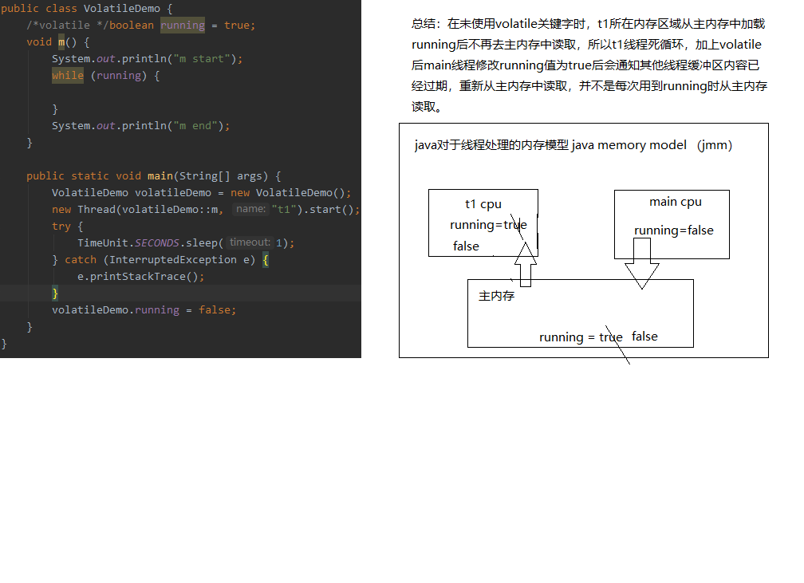

##### volatile关键字作用

> 以前学习javase时没有系统的学过juc，工作中也几乎没有使用，现在甚至基础概念已经模糊了，最近在看一些源码时juc模块的使用穿插其中，遂欣然决定从头学习juc（出来混迟早要还的）。。。。。。。

学习前需要掌握最基础的juc概念

- 线程的概念
- 如何启动一个线程
- 基本的线程同步

volatile比synchronized更轻量级，保证线程之间变量的可见性，
但不能代替synchronized，synchronized能保证变量的原子性。

